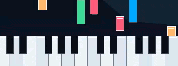

<h1 align="center">InstrumentalCV</h1>

<p align="center">
  <b>Play piano in the air using just your webcam, no MIDI keyboard needed.</b>
</p>

<p align="center">
  
  
  
  
  
</p>
<br>

---
## 📖 Table of Contents


- [Setup](#-setup)
- [Usage](#-usage)
- [Controls](#-controls)
- [Features](#-features)
- [License](#-license)

---
## 🛠 Setup

### Prerequisites

- **Python 3.10+**
- **Webcam** (built-in laptop camera works fine)
- **Windows** (primary platform, not tested on mac and linux)

### 1. Clone the Repository

```bash
git clone https://github.com/AryanSLAYERRR/instrumentalcv.git
cd instrumentalcv
```

### 2. Create a Virtual Environment

```powershell
python -m venv venv
.\venv\Scripts\Activate.ps1
```

### 3. Install Dependencies

```powershell
pip install -r requirements.txt
```

### 4. Run

```powershell
python main.py
```

This opens the InstrumentalCV launcher where you can configure all settings and launch the piano.


### 5. Download Sound Samples

On the first launch, go to the **Settings** tab in the launcher and click **Download Samples** to fetch the instrument sound packs

**Note**: Grand piano is required to be downloaded as other instruments are derived from it, only select grand piano to download if you don't want to download other instruments.

---

## 🎮 Usage

1. **Launch** — Run `python main.py` to open the launcher dashboard
2. **Configure** — Set your camera, instrument, keybed position, tracking, learning mode ( each described in [Features](#-features) section )
3. **Launch Air Piano** — Hit the launch button to start the piano session
4. **Play** — Hold your hands over the webcam and tap fingers on the virtual keys

> [!NOTE]
> Adequate lighting is required for proper hand and finger tracking, otherwise FPS will be low.

---

## ⌨️ Controls

These keyboard shortcuts are available during a live piano session:

| Key | Action |
|-----|--------|
| `1-5` | Switch Piano instrument (Grand, Bright, Electric, Organ, Reverb) |
| `←` / `→` | Shift octave down / up |
| `M` | Toggle metronome |
| `P` | Toggle learning autoplay |
| `-` / `+` | Metronome BPM -5 / +5 |
| `Q`, `ESC` | Quit |

---

## ✨ Features

### 🎯 Smart Play Triggers

Three finger detection modes to suit your style, these can be configured in the settings tab of launcher

| Mode | Description |
|------|-------------|
| **Precision Tap** | <ul><li>Detects intentional downward finger taps with motion filtering, most accurate. <ul><li>Detects the downward motion of the finger with respect to the y coordinates of the wrist joint.</li></ul> </li></ul> |
| **Tap to Play** | <ul><li>Simpler tap detection, good for casual play (use if precision tap is not working well for you). </li></ul> |
| **Hover to Play** | <ul><li>Play notes just by hovering a finger over a key. <ul><li>Folding the tip of your fingers below pip joints in **Hover to Play** mode will make MP not track that finger, i.e. it only plays when finger is extended (prevents accidental notes).</li></ul> </li></ul> |

---

### 🎼 Learning Mode 

Load a song and practice with falling notes that scroll toward the keybed. Supports autoplay using P key.

<p align="center">
  <!-- Screenshot: falling notes during a learning session -->
  
</p>

### 🔧 How to use Learning Mode:

- In the launcher dashboard, go to the **Learning** tab
- Select a song from the dropdown menu
- Few songs are already added, to add your own songs, go to the **Sheet Scanner** tab and select any 1 way to import your song
   - Import .mid file of the song (recommended)
      - If importing through .mid file, use smart-reduced if the song is quite complex (**NOTE** it changes the actual notes of the song (not recommended) )
   - Import .mxl file of the song
   - Import scanned image of the sheet music (experimental)
   - Import PDF of the sheet music (experimental)
   - `experimental - all notes might not be imported correctly using oemer and takes some time to process`
- After importing your song head to **Learning** tab in the launcher
- Turn on falling note toggle, and select your imported song in the dropdown menu
   - Other toggles include Autoplay (Can be toggled live with 'P' key)
   - Autoplayer Performance mode ( does not render the falling notes, only toggle for dense note songs)
- Click on the **Launch Learning Mode** button
- If your song does not fit the octave range you set in the Play tab, it will ask how to handle it
   - Increase the number of visible octaves (max 4 for viable playing)
   - If it still doesn't fit, press **Retune** during launch to remap the song into your chosen range (e.g. a 7-octave song retuned to 4 octaves)
- The piano will start with falling notes — see [Controls](#-controls) for keyboard shortcuts

---

### 🎵 Multiple Instruments

Switch between **5 built-in sample packs** on the fly — no restart needed:

- 🎹 Grand Piano
- ✨ Bright Piano
- ⚡ Electric Piano
- 🎻 Organ
- 🌊 Reverb Piano

---

### 🎶 Song Editor

Create, edit, and save custom songs with the built-in timeline editor. Supports **MIDI** and **MusicXML** import. ( sheet scanner (experimental) )

---


## 📄 License

This project is licensed under the **MIT License** — see [LICENSE](LICENSE) for details.

---

<p align="center"><b>Made by <a href="https://github.com/AryanSLAYERRR">Aryan</a></b></p>